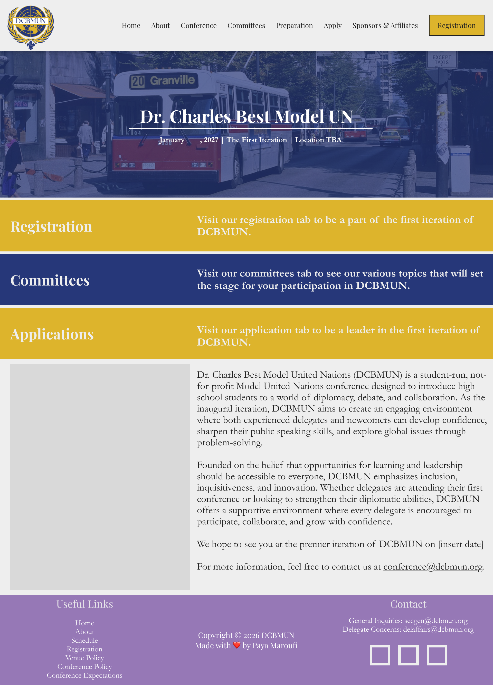

# DCBMUN.github.io

Hey there! This is the website for the upcoming DCBMUN 2027 conference, made by [@Tinkering-Townsperson](https://github.com/Tinkering-Townsperson).

I'm submitting this to [Hack Club Horizons](https://horizons.hackclub.com). See y'all in Toronto!


_Homepage design on Figma_


_Implemented homepage so far_

## Tech stack

This site runs on [Astro](https://astro.build) with [Tailwind](https://tailwindcss.com) for styling.

This was actually my first time using astro, and I'm really happy with how it turned out.
I was pleasantly surprised by how simple it was to pick up!

## How to run locally

```shell
npm install
npm run dev
```

(pretty self-explanatory)

## How it works

The pages in `src/pages` rely on the main layout (`src/layouts/Layout.astro`) which imports
the navbar and footer components. I'm planning on implementing the committee pages by first
making a template file and then mapping routes `/committees/hcc` and `/committees/disec` each
to their own JavaScript object with the data.

I also spent quite some time (not hackatime or lapsed, so it doesn't count ofc) on
[Figma](https://www.figma.com/design/z2aXSyZZ9YLmrcfMc4I3tI/DCBMUN-Website-design?node-id=0-1)
with a team member designing the pages.
